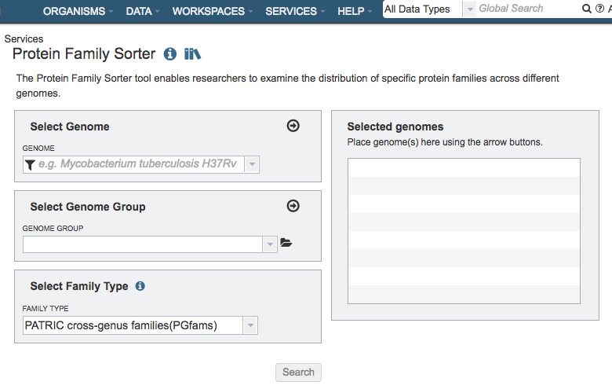

# Protein Family Sorter Service

## Overview
The Protein Family Sorter Service tool enables researchers to examine the distribution of protein families across a set of user-selected genomes. Results are displayed in a page showing all the families associated with the selected genomes, plus filter controls and an interactive heatmap.

### See also
* [Protein Family Sorter Service](https://patricbrc.org/app/ProteinFamily)
* [Comparing Protein Families Across Genomes Tutorial](https://docs.patricbrc.org//tutorial/protein_family_sorter/protein_family_sorter.html)
* [Protein Families Tab](../organisms_taxon/protein_families.html)

## Using the Protein Family Sorter Service
The **Protein Family Sorter** submenu option under the **Services** main menu (Protein Tools category) opens the Protein Family Sorter input form (*shown below*).

## Options
 

## Select Genome
Input box for selecting genomes to include in the comparison. Click the arrow icon (->) to add to the set of Selected Genomes.

## Select Genome Group
Input box for selecting genome group(s) to include in the comparison.  Click the folder icon to navigate through the workspace to locate the genome group(s) of interest. Click the arrow icon (->) to add to the set of Selected Genomes. *Note: You must be logged into PATRIC to access genome groups in your private workspace.*

## Selected Genomes
List of genomes or genome groups that will be used in the comparison

## Select Family Type

### Family Type
Dropdown list of options of protein family types to use in the comparison:

**PATRIC genus-specific families(PLfams):** The genus-specific protein families are computed using only proteins within a genus and more stringent criteria (MCL inflation = 3.0). This provides higher sequence similarity and better specificity while performing within-genus/species or close strain comparisons.

**PATRIC cross-genus families(PGfams):**  The cross-genera protein families are computed by clustering representative proteins from the genus-specific families with slightly relaxed criteria (MCL inflation = 1.1). This allows cross-genera or distant homologs to cluster together, which is necessary to support cross-genera comparative analysis across all microbial genomes.

**FIGFams:** FIGfams are sets of isofunctional homologs, i.e. set of rotein sequences that are similar along their full length and believed to implement the same function. FIGfams are derived from a collection of functional subsystems, as well as correspondences between genes in closely related
strains.

## Buttons

### Search
Launches the Protein Family Sorter Service and, upon completion, displays a page in PATRIC showing all the families associated with the selected genomes, plus filter controls and an interactive heatmap. See [Protein Families Tab](../organisms_taxon/protein_families.html) for a detailed description of how to use the Protein Family Sorter filters and heatmap.
