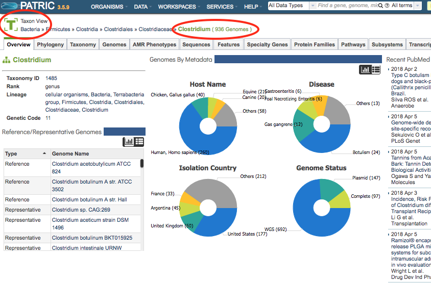
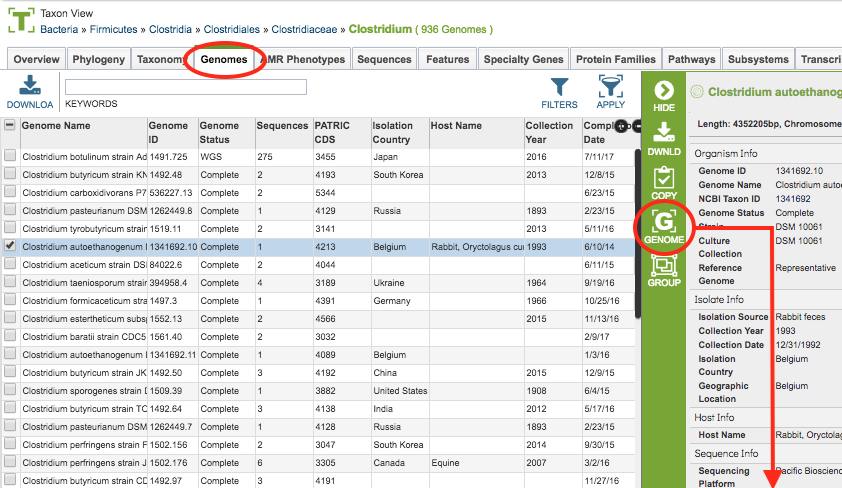
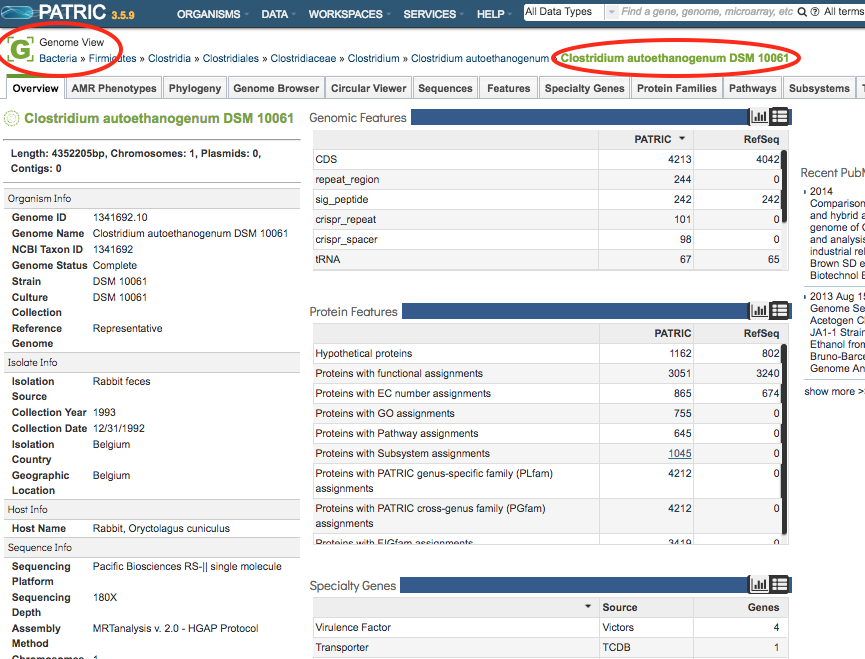

# PATRIC Website Views

The PATRIC website is designed to provide context-sensitive data access and functionality such that when a particular taxon, genome, feature (gene), or group is selected, the surrounding data tabs, tables, and tools are filtered to relevant data for the selection.  This is accomplished through focused "Views," as described below:

## Genome-Based Views

 **Taxon View:** All genomes within the selected taxon level and related data

 **Genome View:** Single annotated genome and related data

 **Genome List View:** All genomes within a selected list and related data

 **Genome Group View:** All genomes within a created group and related data

### Taxon View
The view type is automatically generated based on the selection. For instance, when one of the genera is chosen from the Organisms menu, the **Taxon View**  is displayed, and all of the data tabs (Overview, Phylogeny, Genomes, Features, etc.) contain the genomes and related data _**within that taxon**_.  As illustrated below, selecting _Clostridium_ from the Organisms menu displays the Taxon View for _Clostridium_. 

 

### Genome View
Similarly, selecting a genome in the Genomes Tab and then clicking the **Genome List View** icon in the Action Bar displays the Genome List View. Now all of the data tabs contain data and information _**for that set genome only**_, as illustrated below.

 

### Genome List View
Alternatively, selecting multiple genomes in the Genomes Tab and then clicking the **Genome View** icon in the Action Bar displays the Genome View. Now all of the data tabs contain data and information _**for that genome only**_, as illustrated below. The **Genome Group View** works the same way except that the list of genomes comes from a saved group.

 

## Feature-Based Views
* **Feature View:** Single genomic feature (gene, etc.) and its related data
* **Feature List View:** All features within a selected list and related data
* **Feature Group View:** All features within a created group and related data

