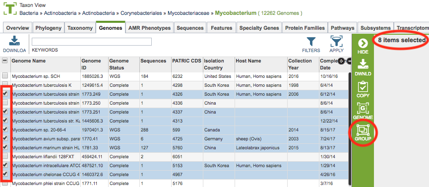
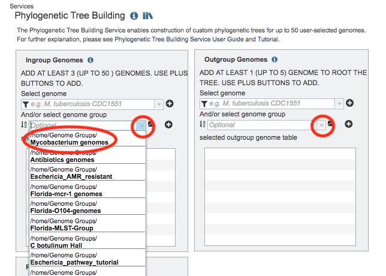

# PATRIC Groups

## Overview
In PATRIC, "Groups" are custom collections of selected genomes or features. They are particularly useful for organizing and managing data sets of interest for further exploration and analysis.

### See also:
  * [Workspace](../workspaces/workspace.html)
  * [Tables](../tables.html)
  * [Action Bar](../action_bar.html)

## Creating and Accessing Groups on the PATRIC Website
A group can created by selecting a set of desired items genomes or features in a table in PATRIC and clicking the Group button on the vertical green Action Bar on the right side of the table. This will open a pop-up window to enable creating a new group containing the selected items or to add the selected items to an existing group in the Workspace.

Once created, the new group will appear in the home Workspace. By default, Genome Groups will appear in the "Genome Groups" folder, and likewise, Feature Groups will appear in the "Feature Groups" folder.

## Using Workspace Groups in the PATRIC Website
Many PATRIC features are available to work with data in groups, including analyzing the items in the group with PATRIC's tools. For example, after creating a Genome Group, you could use the Phylogenetic Tree Building Service to build a phylogenetic tree using the genomes in the group by selecting the group from the "select genome group" dropdown list. All the genome groups you have created will appear in this list.

## Managing Groups in the Workspace
An initial set of directory folders are provided as default locations for groups based on data type, incluidng Genome Groups and Feature Groups. Double-clicking the folder displays a list of the groups in that folder. Clicking the group name selects it, and information about the group is provided in the Information Panel on the right-hand side. See [Workspace](../workspaces/workspace.html) for more information.

### Group Comparison
The PATRIC workspace provides a tool for comparison of membership 

### Action Bar
After selecting one or more groups in the Workspace, a set of options becomes available in the vertical green Action Bar on the right side of the table.  These include

* **Hide:** Toggles (hides) the right-hand side Details Pane.
* **Genomes:** Displays the Genomes Table, listing the genomes that correspond to the selected group.
* **Venn Diagram:** Displays an interactive Venn diagram showing the intersection of up to 3 genome groups. *Available only when more than one group is selected.*
* **Download:** Downloads the selected item.
* **Delete:** Deletes the selected items (rows).
* **Rename:** Allows renaming the selected item.
* **Copy:** Creates copies the selected items and allows the copies to be put into another folder in the Workspace.
* **Move:** Allows moving of the selected item(s) into another folder in the Workspace.
